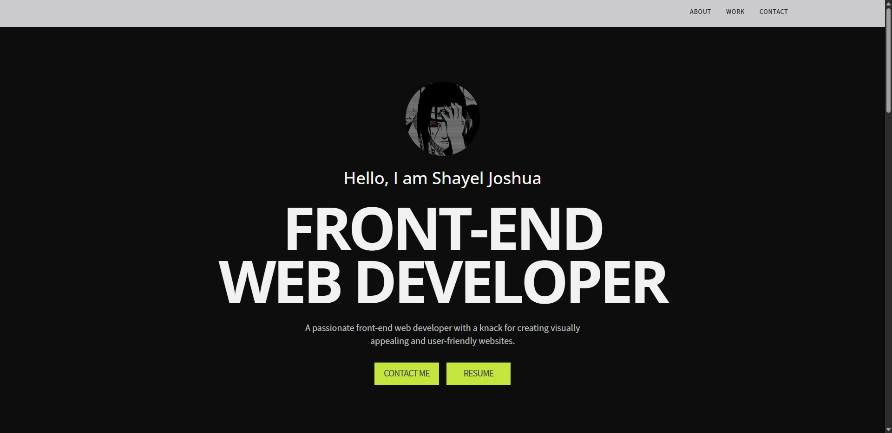
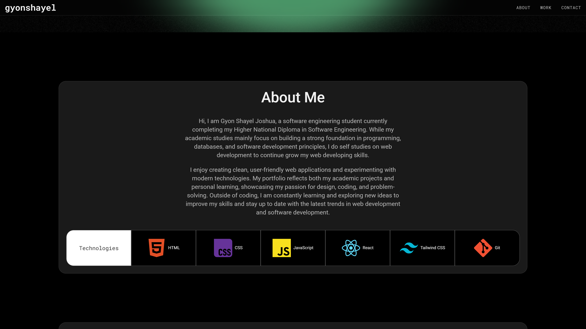
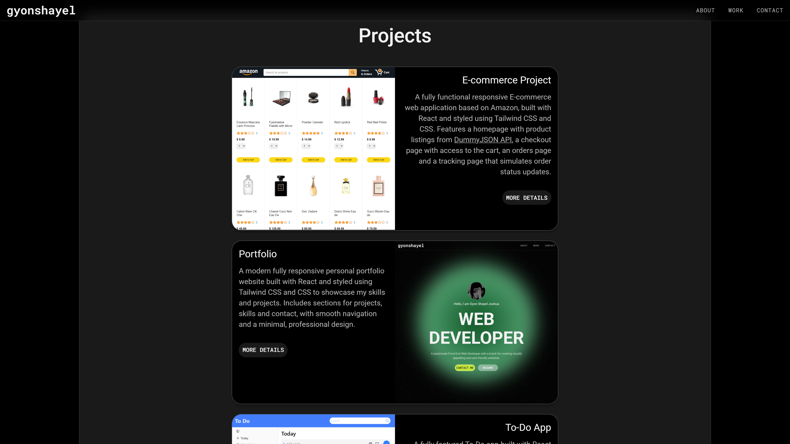
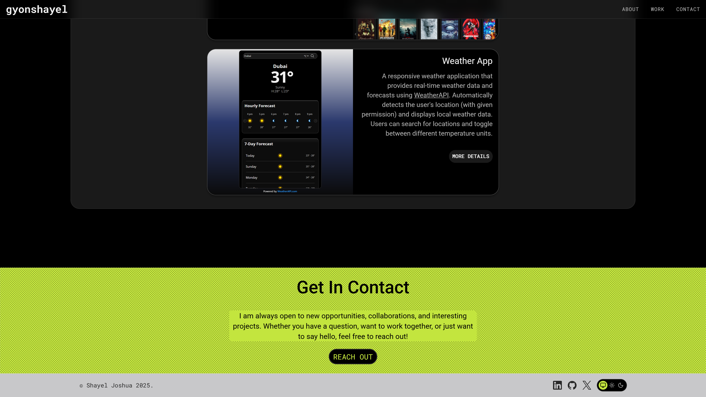

# Portfolio

> A modern fully responsive personal portfolio website built with React and styled using Tailwind CSS and CSS to showcase my skills and projects. Includes sections for projects, skills and contact, with smooth navigation and a minimal, professional design.

---

## 🚀 Live Demo

🔗 [View Live](https://portfolio-v3-kappa-six.vercel.app/)

---

## ✨ Features

- Responsive layout using Grid and Flexbox.
- Smooth navigation and interactive UI components.

---

## 🧰 Tech Stack

- **Framework / Library:** React / GSAP
- **Styling:** Tailwind CSS / CSS
- **Build Tool:** Vite

---

## 📸 Screenshots

---
